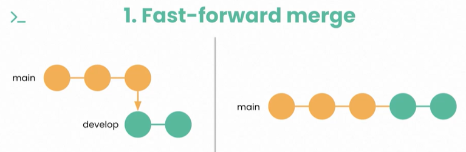
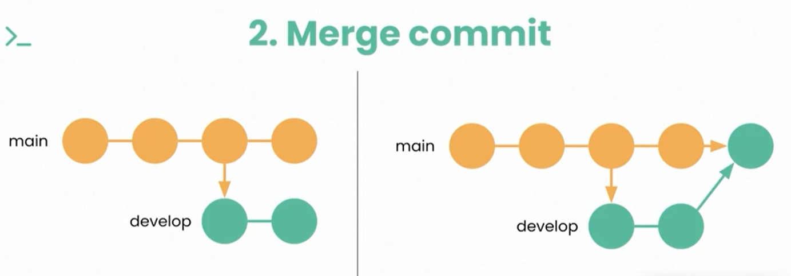
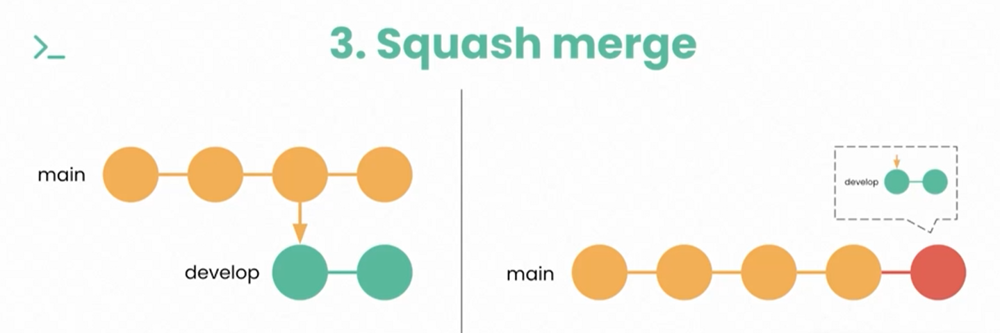

# Ramas
Para qué sirven?:
- Trabajar de forma segura y organizada
- Aislar los cambios
- Experimentar sin comprometer el codigo principal
- trabajar en diferentes funcionalidades simultanemanete
- facilitar el trabajo en equipo

## Crear Ramas (Switch)

__git branch (que ramas existen al momento)__ 

__git switch -c 'nombre-rama' (crear nueva rama)__

__git branch -d 'nombre rama a borrar' (borrar rama)__

## Nombramiento de ramas

- Debe ser descripitvo
- Debe permitir identificar tickets/issues/tareas
- Debe segui un estandar
 
Ejemplos:

__feat45-add-navbar__

__fix-contact-cta__

## Cuándo crear?

Al -> agregar, arreglar, eliminar, modificar 

## Navegar entre ramas

__git switch <nombre de la rama>__

## Estrategias de merges

Unir ramas (Merge)

Para fusionar cambios al flujo de trabajo principal

__git merge <rama a fusionar>__

1. __Fast  forward  merge__
Cuando la rama que contiene los nuevos cambios, tiene actualizada la utlima version de la rama padre
Git

2.  __Merge commit__
Se genera un nuevo commit cada qu ese hace merge. y en este commit contiene los cabios que se estan uniendo en el merge. se utiliza por defecto cuando la rama que contiene los cambios no esta actuazlizada con la ultima version de la rama padre

3. __Squash merge__
Una combinacion de los anteriores, se genera un nuevo commit que contiene todos los cambios de la roma que vamos a funcionar, y el apuntador de la rama padre se mueve hacia ese commit

