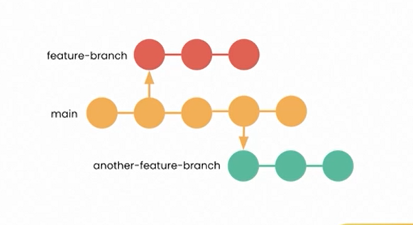
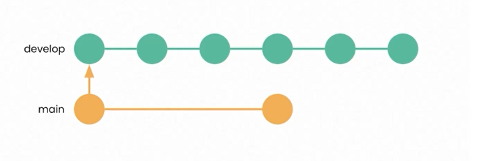
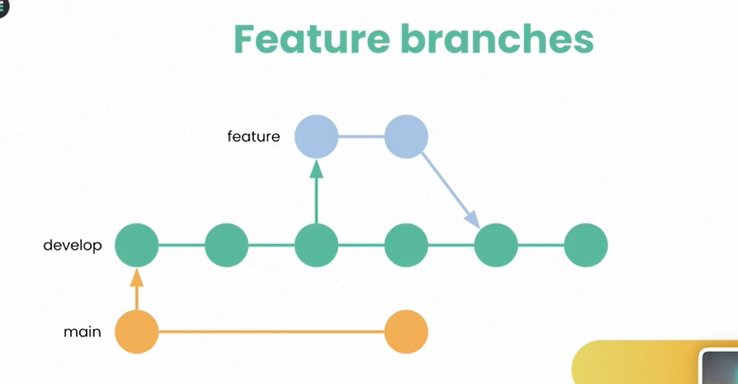
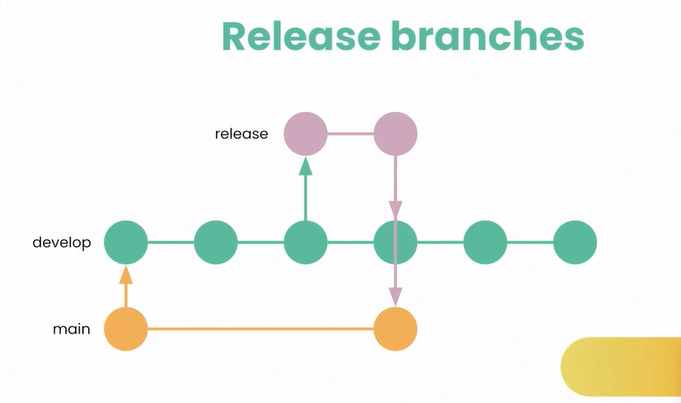
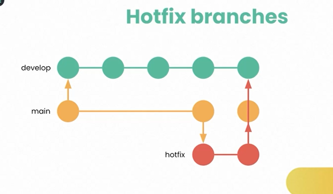
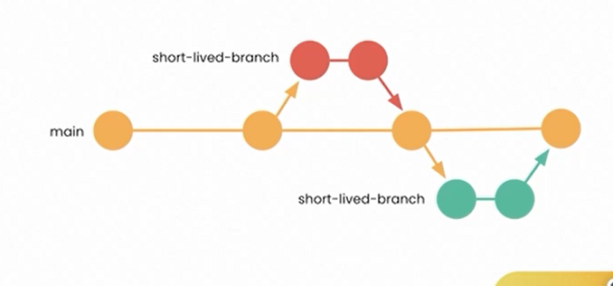

# Qué es un git workflow?
Una forma de definir como trabajar en git. Lineamiento para tener una forma consistente:
- Nombramiento de ramas
- Nombramiento de commits
- Creación de ramas
- Merge de ramas
  
## Criterios para elegir un workflow
- Funciona para el tamañp del equipo-empresa
- Permite responder a incidencias

## Workflows populares

### Featured based

Workflow simple y sencillo

- Cada desarrollador crea una rama para cada cambio que va a intruducir
- Al finalizar sus cambios envia un pull-request con el codigo que quiere realizar

__Beneficios:__
- Mejora la calidad de codigo
- Fomenta la colaboracion en equipo
- Aumenta el conocimiento del equipo
- Ahorra tiempo y recursos

## GitFlow

Utiliza dos rama pricipales __main__ y __develop__, main contiene la rama estable y develop donde se lleva el desarrollo, a su vez, lleva ramas adicionales, para desarrollar nuevas carateristicas 

__Feature branches__

Se crean apartir de la rama develop y se fucionan con ella una ve terminada la implementación.

__Release branches__

Se utiliza para preparar una version del codigo para su lanzamiento, se crear apartir de develop y se funcionan en la rama master.

__Hotfix branches__

Se crean para reolver problemas __urgentes__ en la rama master, se crean apartir de la rama master y luego se fuionan a la rama master y develop, una vez son solucionados los problemas.

## Trunk based
En un nuevo auge, se evita el uso de muchas ramas. Es un flujo centrado en una rama principal para el desarrollo, todos trabajan en la misma rama, se basa en la integracion continua.

__Ventajas:__
- Simplicidad
- Entrega rápida
- Menor complejidad
- Mayot visibilidad
  